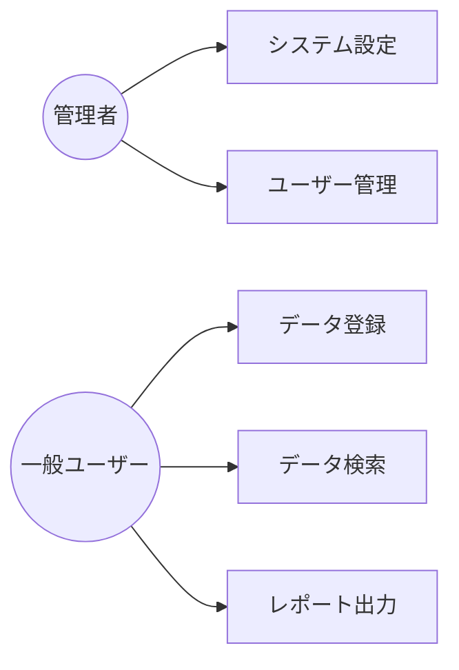

# 4-1. ユースケース図

```mermaid
graph LR
    管理者((管理者))
    ユーザー((一般ユーザー))

    管理者 --> UC1[システム設定]
    管理者 --> UC2[ユーザー管理]
    ユーザー --> UC3[データ登録]
    ユーザー --> UC4[データ検索]
    ユーザー --> UC5[レポート出力]
```

> Warikan specification 2025 のユースケース図
