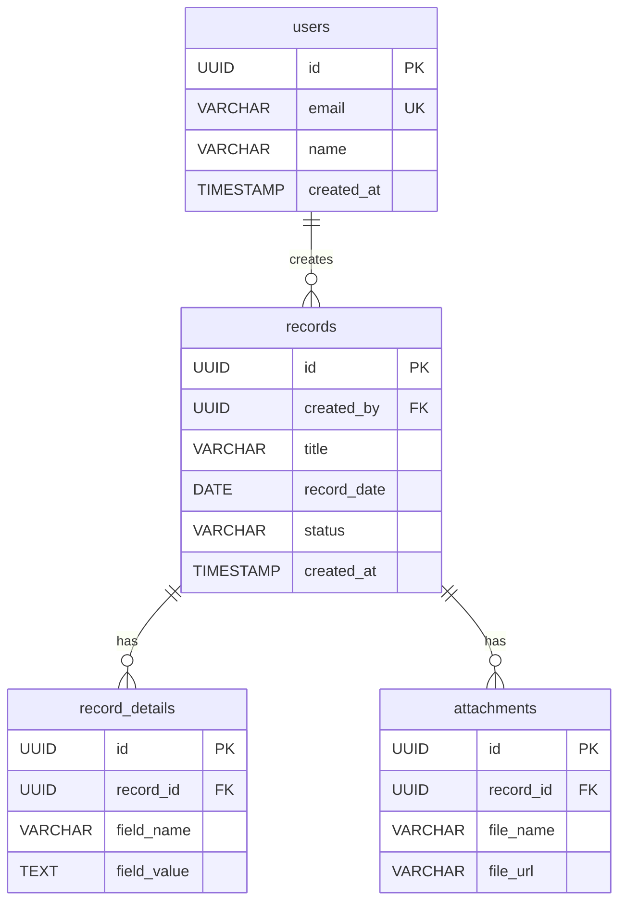

# 6-1. ER図

```mermaid
erDiagram
    users ||--o{ records : "creates"
    records ||--o{ record_details : "has"
    records ||--o{ attachments : "has"

    users {
        UUID id PK
        VARCHAR email UK
        VARCHAR name
        TIMESTAMP created_at
    }

    records {
        UUID id PK
        UUID created_by FK
        VARCHAR title
        DATE record_date
        VARCHAR status
        TIMESTAMP created_at
    }

    record_details {
        UUID id PK
        UUID record_id FK
        VARCHAR field_name
        TEXT field_value
    }

    attachments {
        UUID id PK
        UUID record_id FK
        VARCHAR file_name
        VARCHAR file_url
    }
```

> Warikan specification 2025 のER図
