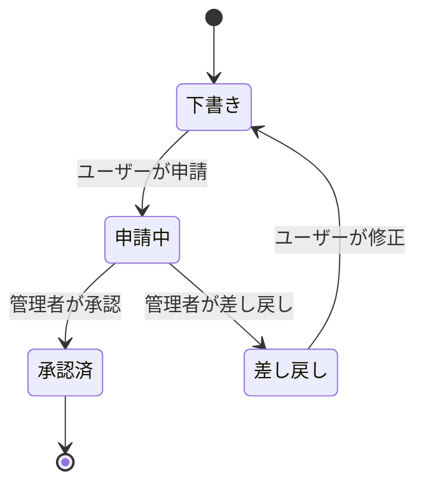

# 8-1. 状態遷移図

## データステータス（Warikan specification 2025）

| 状態 | 説明 | 遷移条件 |
|------|------|---------|
| 下書き | 初期状態 | データ作成時 |
| 申請中 | 承認待ち | ユーザーの申請 |
| 承認済 | 承認完了 | 管理者の承認 |
| 差し戻し | 修正が必要 | 管理者の差し戻し |
